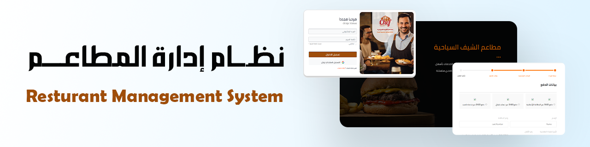
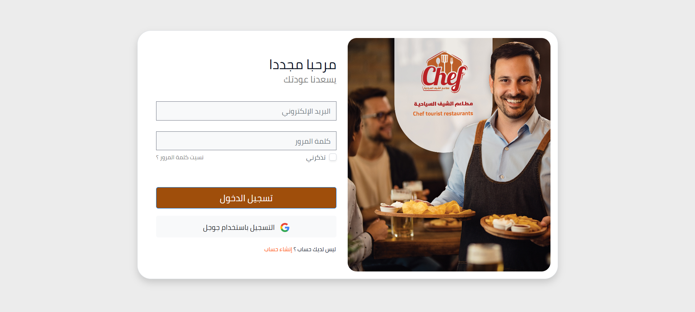
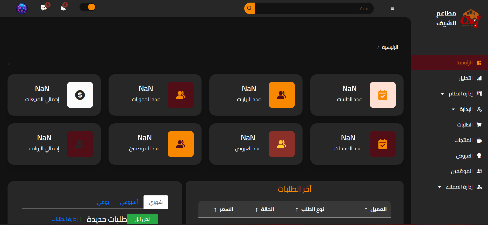
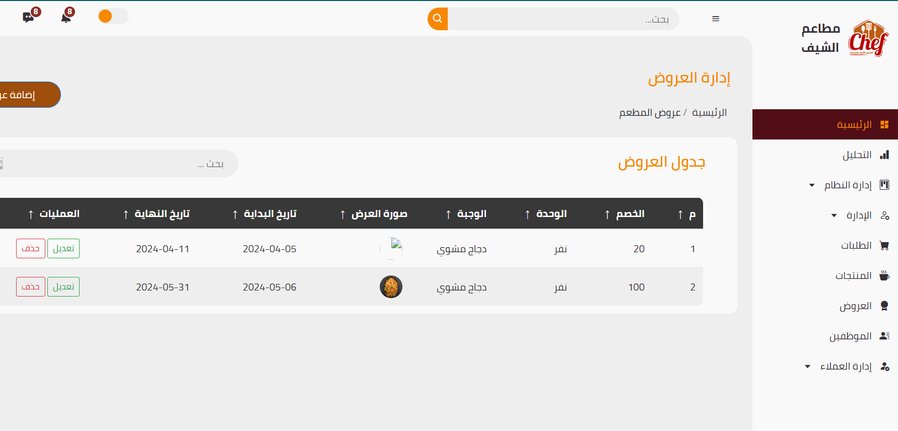
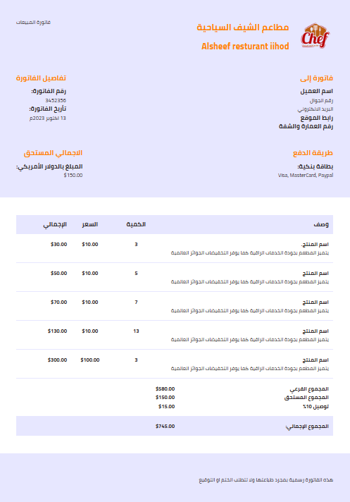
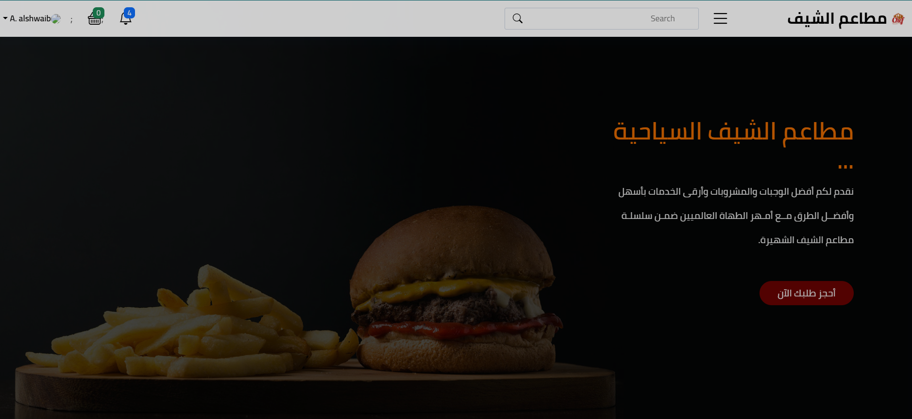
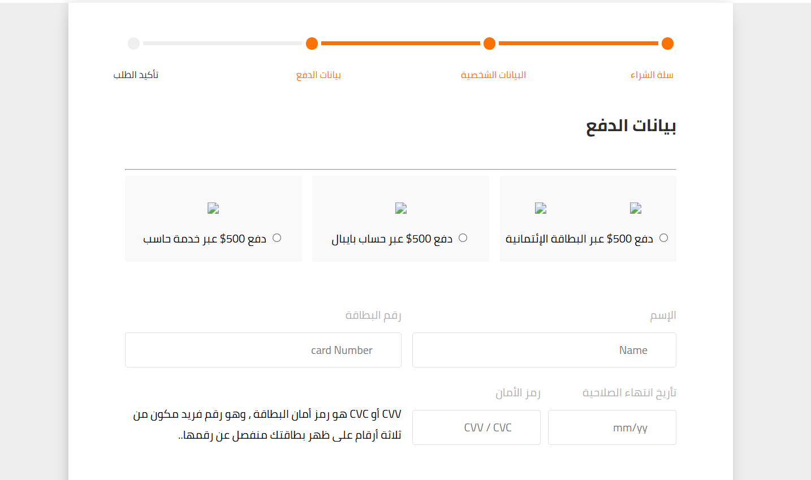

# Restaurant Management System (Laravel 9)

[](https://github.com/Al-shwaib/Restaurant-Management-System/stargazers)
[](https://github.com/Al-shwaib/Restaurant-Management-System/commits/main)
[](https://github.com/Al-shwaib/Restaurant-Management-System/actions)



A modern academic web application built with Laravel, developed as a practical project for a university Web Development course. The system offers both a customer-facing website and a comprehensive admin dashboard for managing restaurant operations. Designed for educational purposes, the project demonstrates real-world application architecture and user experience practices.

تطبيق ويب أكاديمي حديث تم تطويره باستخدام Laravel، كجزء من مشروع تطبيقي في مادة تطوير الويب بالجامعة. يقدّم النظام واجهتين: موقع مخصص للعملاء ولوحة تحكم متقدمة للمسؤول لإدارة عمليات المطعم. يهدف المشروع إلى التعلم وتطبيق مفاهيم برمجة الويب بشكل عملي، مع التركيز على تجربة المستخدم وبنية المشاريع الواقعية.


---

## 🧑‍💻 Technologies Used
- **Bootstrap 4** (for responsive UI)
- **Laravel 9**
- **Vite**
- **jQuery**
- **Axios**
- **SweetAlert2**
- **Font Awesome**

---

## 🎯 Main Objectives
- Dual interfaces: Admin & Customer
- Light/Dark mode support
- Responsive design for all devices

---

## 👨‍💼 Admin Dashboard Features
- Admin Login Page
- Branch Management
- Table Management
- System Settings
- Product Management
- Offers Management
- Orders Management
- Staff Management
- Customer Management
- Purchase Invoices

---

## 👥 Customer Interface Features
- Home Page
- Categories
- Offers & Discounts
- My Orders
- Suggestions
- Favorites
- Cart & Checkout

---

## ✨ Additional Features
- Multi-language support
- Smooth and easy user experience
- Fast browsing and page loading

---

## 📸 Screenshots
Screenshots of main system interfaces are available in the [`/Screenshots`](../Screenshots) folder. Each screenshot is named for easy reference. Example:

| Interface                | Screenshot                                      |
|--------------------------|-------------------------------------------------|
| Admin Login Page         |  |
| Admin Dashboard          |   |
| Offers Page              |           |
| invoice Page             |         |
| Customer Home            |      |
| Cart & Checkout          |               |

> _Replace the screenshot file names with real ones as needed._

---

## 📦 Project Structure
```text
Resturant_Managment/
├── public/
├── resources/
│   ├── css/
│   ├── js/
│   └── views/
├── routes/
│   ├── api.php
│   ├── console.php
│   └── web.php
├── app/
├── config/
├── database/
├── tests/
├── package.json
├── composer.json
└── ...
```

---

## 💼 CV Highlights

You can mention this project in your CV as follows:

**Project Name:** Restaurant Management System (Academic Project)

**Project Description:**
Developed a web-based platform for restaurant management with a dual interface (Admin & Customer), supporting responsive design, light/dark mode, and multi-language features.

**Key Skills & Technologies:**
- UI/UX design with **Bootstrap 4** and **Font Awesome**
- Interactive front-end using **jQuery**, **Axios**, **SweetAlert2**
- Asset management with **Laravel Mix** and **Vite**
- Modular system development: branches, tables, products, offers, orders, staff, customers, and invoices
- Customer journey: browsing, offers, orders, favorites, and checkout
- Responsive, fast, and user-friendly design
- Multi-language and dark/light mode support

**Soft Skills:**
- Team collaboration on academic projects
- Requirements analysis and feature prioritization
- Applying UI/UX best practices

**Screenshots:**
Key interface screenshots are available in the `/Screenshots` folder and can be shared upon request or in your portfolio.

---

## 🙌 Contributors
- Abdulkoddos Al-Showaib
- Abdallah Alkhazragi
- Abdu Al-Ward
- Ali Al-Daghar

---

> _This project is for academic demonstration and not intended for production use._
